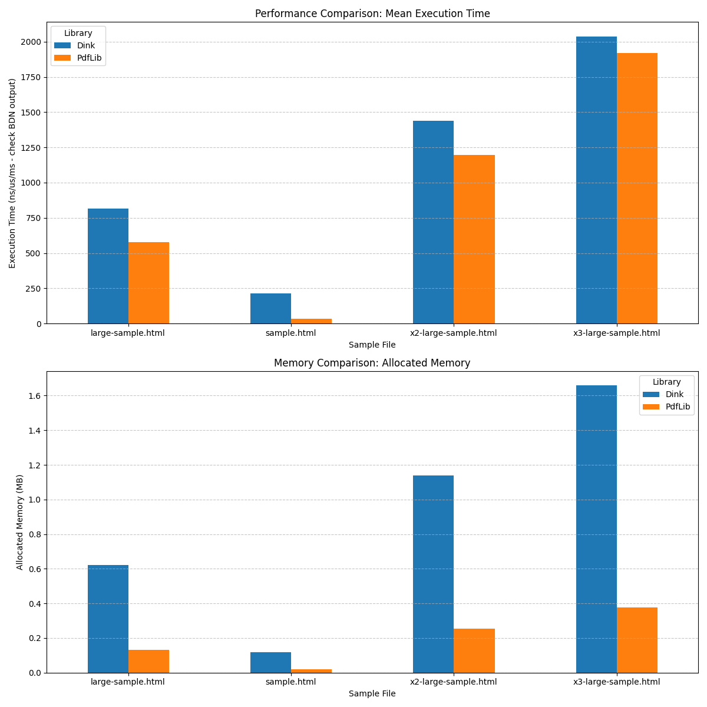

# PDF Lib

[](https://www.nuget.org/packages/Badger.PDFLib.Chromium)
[](https://www.nuget.org/packages/Badger.PDFLib.Chromium)

[Documentation Site](https://jbraunsmajr.github.io/PDFLib/index.html)

Join me in the descent into madness, as I explore the possibilities of PDF generation.

Honestly, this was a product of me being bored and wondering what it would take
to generate a PDF without using external libraries. It... is... interesting to say the least.

As I progressed through the stages of wonder... I realized that there's some potential
in it.



# Overview

The C# Project **PDFLib.Razor** is a library that manually crafts PDFs without using third-party libraries. Went on to explore
the possibility of using Razor syntax to generate PDFs as well, instead of pursuing a fluent-api. After playing with the idea,
I realized the difficulty in pursuing styling. Developers would also require a "PDF" version of their webpages, which is
not ideal.

To leverage existing HTML/CSS, one requires a renderer. WebKit and Blink are the two most popular choices. For the time being,
I've opted to use Chrome's headless Chromium since it's said to be pixel-perfect when creating PDFs.

**PDFLib.Chromium** is where Chromium is being explored. The difficulty lies in extracting as much performance out of it as possible. There is an inherited overhead by using a browser (albeit headless)
as it has to render using Blink engine and runs the V8 engine for JavaScript.

# Research / Path

## The Renderer / Headless Chromium

[Headless Chromium](https://github.com/chromium/chromium/blob/main/headless/README.md) is a package
google made available which contains the Blink and V8 engines, 200MB than full browser.

## Interop

IronPDF, based on some snooping, appears to have some form of C++ shared libraries they created.

Google suggests using Puppeteer, or websockets. However, I suspect using a named pipe (linux only) will be
enough.

The `--remote-debugging-pipe` flag leverages file descriptors 3 (Standard in/out), and 4. .NET only supports 0, 1, and
2.
So we have to redirect things.

## Base64

Chromium's CDP sends data using Base64 inside JSON, so there is no way around this in the current DevTools
Protocol. Base64 is ~33% larger than raw binary. Although not ideal, we can work with it.

## Known things

During testing, I've noticed a few error messages, but they don't seem to affect the output. There might be a way to suppress
them but have not figured it out yet.

```
[0104/155522.469691:ERROR:dbus/bus.cc:406] Failed to connect to the bus: Failed to connect to socket /run/dbus/system_bus_socket: No such file or directory                                               
[0104/155522.470946:ERROR:dbus/bus.cc:406] Failed to connect to the bus: Failed to connect to socket /run/dbus/system_bus_socket: No such file or directory
[0104/155522.471026:ERROR:dbus/bus.cc:406] Failed to connect to the bus: Failed to connect to socket /run/dbus/system_bus_socket: No such file or directory
[0104/155522.567381:WARNING:device/bluetooth/dbus/bluez_dbus_manager.cc:209] Floss manager service not available, cannot set Floss enable/disable.
```

## Benchmarks currently

| File                 | Page Count |
|----------------------|------------|
| sample.html          | 2          |
| large-sample.html    | 140        |
| x2-large-sample.html | 280        |
| x3-large-sample.html | 420        |

| Method | FileName             |        Mean |     Error |    StdDev |      Median |  Allocated |
|--------|----------------------|------------:|----------:|----------:|------------:|-----------:|
| Dink   | large-sample.html    | 1,010.58 ms |  9.862 ms |  8.235 ms | 1,007.34 ms |  636.86 KB |                                                                                                        
| PdfLib | large-sample.html    |   845.99 ms |  8.489 ms |  7.089 ms |   845.25 ms |  138.13 KB |
| Dink   | sample.html          |   250.86 ms |  4.952 ms |  8.543 ms |   253.14 ms |  119.42 KB |
| PdfLib | sample.html          |    52.36 ms |  2.575 ms |  7.591 ms |    49.46 ms |   19.48 KB |
| Dink   | x2-large-sample.html | 1,794.39 ms | 11.802 ms |  9.855 ms | 1,793.57 ms | 1166.98 KB |
| PdfLib | x2-large-sample.html | 1,712.90 ms | 15.502 ms | 12.945 ms | 1,708.03 ms |  261.83 KB |
| Dink   | x3-large-sample.html | 2,572.94 ms |  7.158 ms |  6.346 ms | 2,573.16 ms | 1698.45 KB |
| PdfLib | x3-large-sample.html | 2,806.93 ms | 23.164 ms | 21.668 ms | 2,801.68 ms |  385.69 KB |


DinkToPdf builds on top of a wkhtmltopdf library which was the defacto standard for server-based PDF generation. However, 
it was built on top of the QT engine's implementation, which is no longer maintained or supported. It's not recommended to 
use wkhtmltopdf due to security vulnerabilities. Also does not support the latest JavaScript, HTML, or CSS features.

# NuGet Deployment & Prerequisites

**PDFLib.Chromium** is available as a NuGet package.

## PDFLib.Chromium
This library requires **Headless Chromium** and specific system libraries to function.

### Platform Support
Currently, `PDFLib.Chromium` uses Linux-specific APIs (`pipe`, `fcntl`) for communication with Chromium and is intended for use on **Linux** (including Docker containers.... especially Docker containers).

### Prerequisites
To use `PDFLib.Chromium`, you must ensure that Chromium and its dependencies are installed in your environment.

#### 1. Chromium Headless Shell
By default, the library expects `chrome-headless-shell` to be available in your system PATH.

**Automatic Bundling**:
Automatically download and bundle the latest Chromium binary into the NuGet package by running:

```bash
dotnet pack -p:DownloadLatestChromium=true
```

Alternatively, you can manually run the download script:
```bash
./scripts/download-chromium.sh
```

This will place the binary and its sidecar files in `PDFLib.Chromium/runtimes/linux-x64/native/`.

**Manual Bundling**
You can also manually place the `chrome-headless-shell` binary into the following directory before packing or building:
`PDFLib.Chromium/runtimes/linux-x64/native/chrome-headless-shell`

#### 2. Linux Dependencies
Even when bundling the Chromium binary, you **must** still install the necessary system-level shared libraries and fonts on your Linux host. These are required for Chromium to run.

```bash
apt-get update && apt-get install -y --no-install-recommends \
    wget zlib1g fontconfig libfreetype6 libx11-6 libxext6 libxrender1 \
    libssl3 xfonts-75dpi xfonts-base curl unzip libnss3 libatk1.0-0t64 \
    libatk-bridge2.0-0 libcups2 libdrm2 libxcomposite1 libxdamage1 \
    libxfixes3 libxrandr2 libgbm1 libasound2t64 libxkbcommon0 \
    libpango-1.0-0 libpangocairo-1.0-0 libxshmfence1 fonts-liberation \
    libfontconfig1 ca-certificates fonts-ipafont-gothic fonts-wqy-zenhei \
    fonts-thai-tlwg fonts-kacst fonts-freefont-ttf fonts-noto-color-emoji \
    fonts-dejavu-core
```

For a complete reference on how to set up the environment, see the [Dockerfile](./PDFLib.Chromium.TestConsole/Dockerfile).

# PDFLib.Chromium.Hosting

This library provides a seamless way to integrate `PDFLib.Chromium` into your .NET web applications as a singleton service.

## Installation

Add the `PDFLib.Chromium.Hosting` package to your project.

## Configuration

In your `Program.cs`, you can add the Chromium browser service:

```csharp
// Using Action
builder.Services.AddChromiumBrowser(options => {
    options.MaxConcurrentRenders = 10;
});

// OR Using IConfiguration
builder.Services.AddChromiumBrowser(builder.Configuration.GetSection("Chromium"));
```

```json
{ 
  "Chromium": {
    "MaxConcurrentRenders": 10
  }
}
```

## Usage

Inject `ChromiumBrowserService` into your controllers or services:

```csharp
public class PdfController : ControllerBase
{
    private readonly ChromiumBrowserService _pdfService;

    public PdfController(ChromiumBrowserService pdfService)
    {
        _pdfService = pdfService;
    }

    [HttpGet("generate")]
    public async Task GetPdf()
    {
        Response.ContentType = "application/pdf";
        await _pdfService.RenderPdfAsync("<h1>Hello World</h1>", Response.Body);
    }
    
    [HttpGet("sign")]
    public async Task GetSignedPdf()
    {
        Response.ContentType = "application/pdf";
        await _pdfService.RenderSignedPdfAsync("<div id="signature-area-1">Sign here</div>", Response.Body, signer => {
            signer.AddCertificate(new X509Certificate2("cert.pfx", "password"));
        });
    }
}
```
