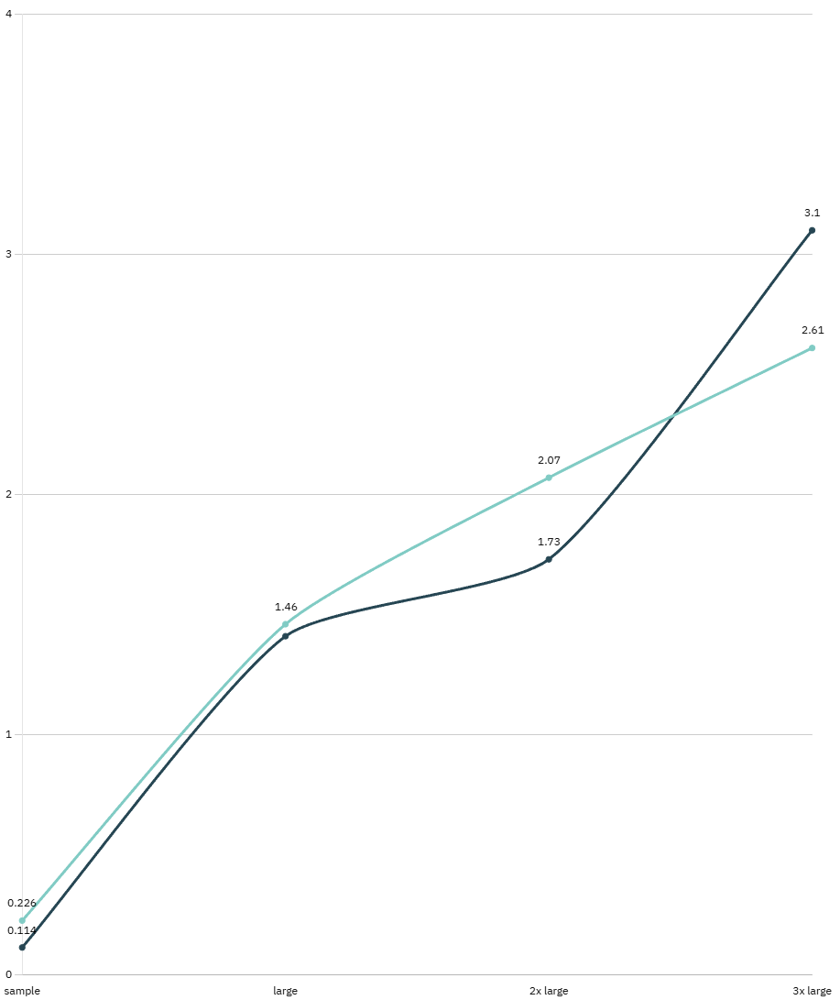

# PDF Lib

Join me in the descent into madness, as I explore the possibilities of PDF generation.

Honestly, this was a product of me being bored and wondering what it would take
to generate a PDF without using external libraries. It... is... interesting to say the least.

As I progressed through the stages of wonder... I realized that there's some potential
in it.

This project is still in its early stages and is not yet ready for production use.

----

# Overview

The C# Project **PDFLib** is a library which manually crafts PDFs, without using third-party libraries. Went on to explore
the possibility of using Razor syntax to generate PDFs as well, instead of pursuing a fluent-api. After playing with the idea,
I realized the difficulty in pursuing styling. Developers would also require a "PDF" version of their webpages, which is not ideal.

To leverage existing HTML/CSS, one requires a renderer. WebKit and Blink are the two most popular choices. For the time being,
I've opted to use Chrome's headless Chromium since it's said to be pixel-perfect when creating PDFs.

**PDFLib.Console** is where Chromium is being explored. Interestingly enough, for small workloads it outperforms DinkToPdf,
but that quickly changes as the workload size increases. 

# Research / Path

## The Renderer / Headless Chromium

[Headless Chromium](https://github.com/chromium/chromium/blob/main/headless/README.md) is a package
google made available which contains the Blink and V8 engines, 200MB than full browser.

## Interop

IronPDF, based on some snooping, appears to have some form of C++ shared libraries they created.

Google suggests using Puppeteer, or websockets. However, I suspect using a named pipe (linux only) will be
enough.

The `--remote-debugging-pipe` flag leverages file descriptors 3 (Standard in/out), and 4. .NET only supports 0, 1, and 2.
So we have to redirect things.

## Base64

Chromium's CDP sends data using Base64 inside JSON, so there is no way around this in the current DevTools 
Protocol.

Base64 is ~33% larger than raw binary. However, by reading 1MB, the 33% overhead yields about 1.33MB of string data.
Although not ideal, it's fairly negligible considering the state of the modern internet.

## Known things

Apparently the following errors are "normal" and do not impact PDF generation
```
[0104/155522.469691:ERROR:dbus/bus.cc:406] Failed to connect to the bus: Failed to connect to socket /run/dbus/system_bus_socket: No such file or directory                                               
[0104/155522.470946:ERROR:dbus/bus.cc:406] Failed to connect to the bus: Failed to connect to socket /run/dbus/system_bus_socket: No such file or directory
[0104/155522.471026:ERROR:dbus/bus.cc:406] Failed to connect to the bus: Failed to connect to socket /run/dbus/system_bus_socket: No such file or directory
[0104/155522.567381:WARNING:device/bluetooth/dbus/bluez_dbus_manager.cc:209] Floss manager service not available, cannot set Floss enable/disable.
```

## Benchmarks currently

Would appear as the file increases in size, PdfLib decreases in performance. Requires further investigation, quite possible it's the 
CDP overhead / allocations.

| Method | FileName             | Mean       | Error     | StdDev    | Median     | Gen0      | Gen1      | Allocated   |
|------- |--------------------- |-----------:|----------:|----------:|-----------:|----------:|----------:|------------:|
| Dink   | large-sample.html    | 1,463.7 ms |  88.62 ms | 261.30 ms | 1,477.9 ms |         - |         - |   556.66 KB |                                                                                 
| PdfLib | large-sample.html    | 1,412.9 ms |  83.36 ms | 245.79 ms | 1,521.8 ms | 1000.0000 |         - |  9023.87 KB |
| Dink   | sample.html          |   226.9 ms |   4.53 ms |   6.04 ms |   224.9 ms |         - |         - |   119.41 KB |
| PdfLib | sample.html          |   114.3 ms |   7.00 ms |  20.31 ms |   114.7 ms |         - |         - |    87.59 KB |
| Dink   | x2-large-sample.html | 2,067.1 ms | 112.95 ms | 318.59 ms | 1,887.9 ms |         - |         - |  1006.61 KB |
| PdfLib | x2-large-sample.html | 1,732.4 ms |  11.41 ms |  10.67 ms | 1,733.7 ms | 1000.0000 |         - | 19073.21 KB |
| Dink   | x3-large-sample.html | 2,611.6 ms |   9.80 ms |   9.17 ms | 2,611.5 ms |         - |         - |  1457.91 KB |
| PdfLib | x3-large-sample.html | 3,104.5 ms |  66.57 ms | 183.36 ms | 3,062.2 ms | 3000.0000 | 2000.0000 | 21212.35 KB |

| Color | Lib       |
| --- |-----------|
| Green | DinkToPdf |
| Black | PDFLib    |

